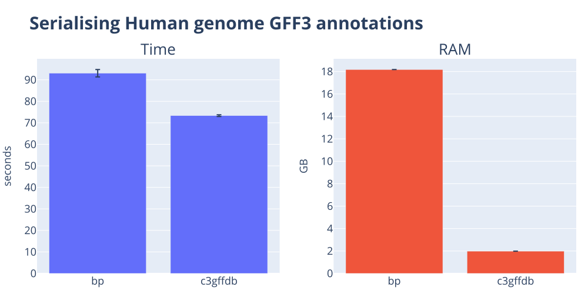
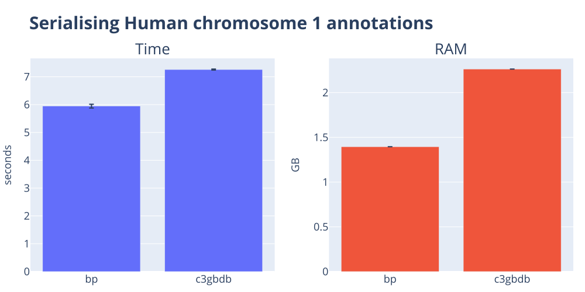
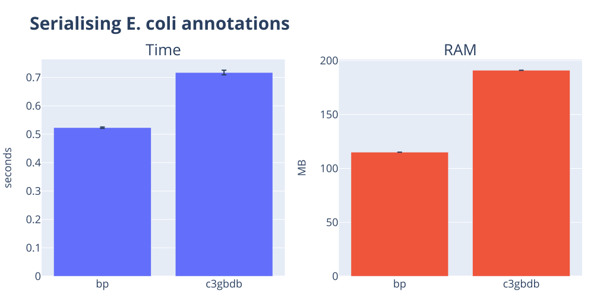
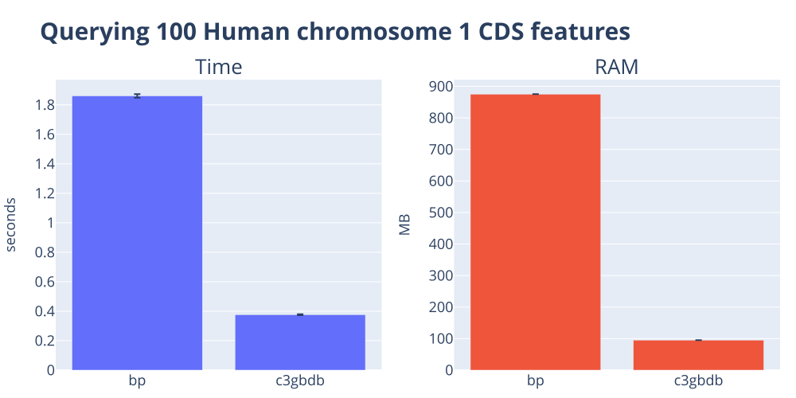
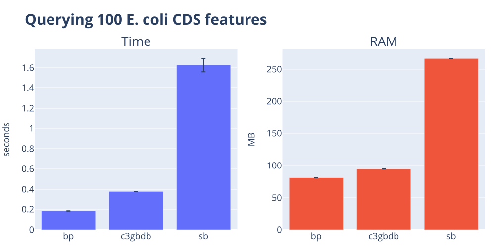
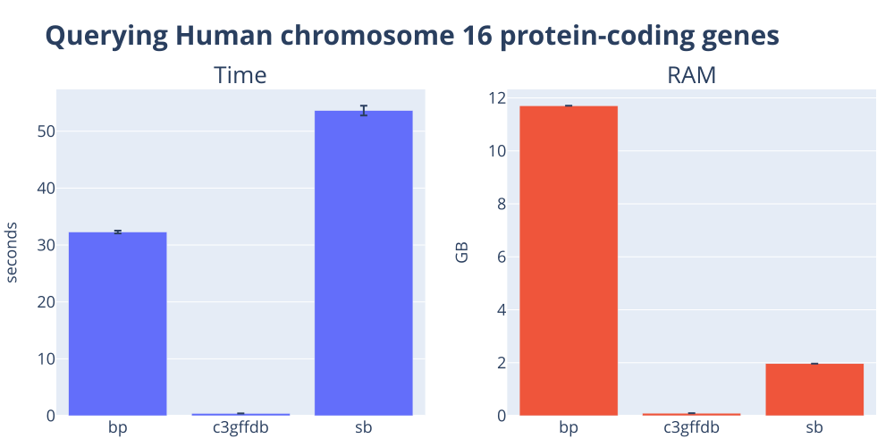
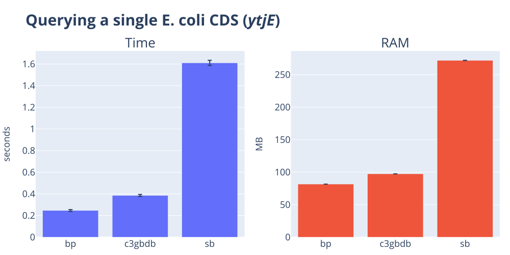
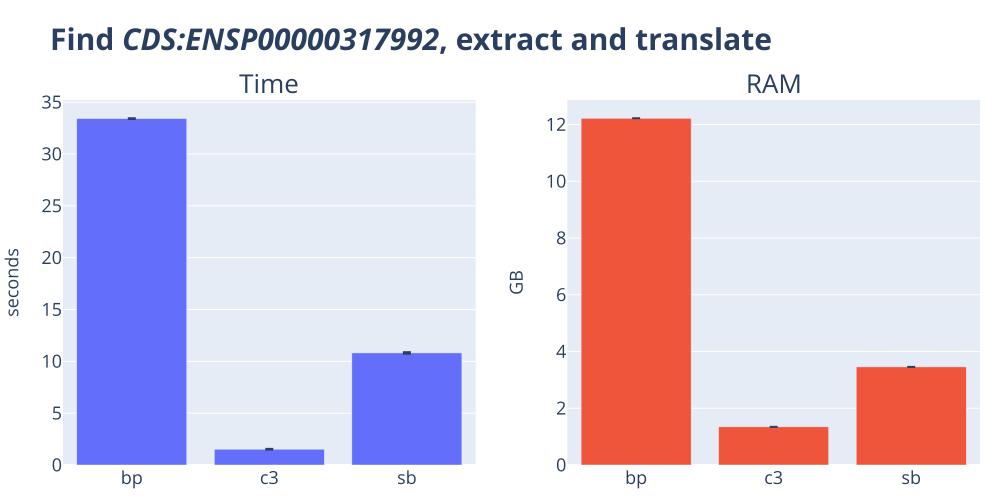

# The genome annotation handling shootout 🔫

Genome annotation data are a fundamental reflection of the state of our understanding of a genome. Any software package that claims to provide generic genomic data handling must also be great for handling genome annotations (aka genome features). Right? In this post, I put this assertion to the test for [biopython](https://biopython.org), [cogent3](https://cogent3.org), and [scikit-bio](https://scikit-bio.org). In a nutshell, only `cogent3` acquits itself with some distinction. On large datasets, `cogent3` can be orders of magnitude faster and use orders of magnitude less memory than the others. It also requires much less code 🤯. But there is room for improvement across *all* packages.

<!-- more -->

## The goal

Genome annotations can take many forms. All of them represent the genomic coordinates of some meta-data description of a genome, such as the locations of genes, genetic variation, and so on. In a [previous post](../benchmark_parsers/index.md), we compared the performance of the popular [biopython](https://biopython.org), [cogent3](https://cogent3.org), and [scikit-bio](https://scikit-bio.org) packages in parsing standard formats, including those for genome annotations. In that post we noticed substantial differences in raw parsing speed with `cogent3` often being a lot faster. We qualified the performance difference by pointing out how much more complex annotation data is and that we needed to reserve judgement regarding `biopython` and `scikit-bio` until we had evaluated their merits on handling annotation data.

In this post, I do this by contrasting how these packages support working with genome annotations, including the complexity of relating annotations to their associated genomic sequence. I evaluate the ability to:

1. Transform standard flat file formats into a serialised data format suitable for reuse across Python sessions
2. Search for annotations matching specified conditions
3. Integrate annotation searching with selecting and transforming the corresponding genomic sequence

??? info "Methods and Datasets"
    The benchmark code lives in [the c3-benchmarking repository](https://github.com/cogent3/c3-benchmarking).

    I time each `(task, tool)` pair as a standalone process using [hyperfine](https://github.com/sharkdp/hyperfine). The orchestrator invokes `hyperfine --command-name <tool> '<shell-cmd>'` once per tool, runs each command three times by default, and aggregates the mean and standard deviation of wall-clock time and peak resident memory into a per-task TSV. This means we include Python startup, imports, and all that fun stuff as part of the measurements.

    **Dataset summary**

    These datasets can be obtained via the repo linked to above.

    --8<-- "docs/posts/benchmark_ann_query/datasets_summary.txt"

??? info "Tools summary"
    The abbreviations shown in the table are used in all the result tables and figures below. We also include code snippets used for each tool. These are extracted verbatim from the benchmarking project and hence contained within individual functions.

    `biopython` is the oldest of these packages, dating back to 2002. `cogent3` and `scikit-bio` both originated from PyCogent ([published in 2007](https://www.ncbi.nlm.nih.gov/pubmed/17708774)). `cogent3` is the closest to the original PyCogent feature set while `scikit-bio` appears to be primarily focussed on microbes.

    !!! note "I was a founder of the PyCogent project and am the founder of `cogent3`."

    --8<-- "docs/posts/benchmark_ann_query/tools_summary.txt"

## Serialisation of annotation data

!!! abstract "Aim"
    Because serialized data is usually more efficient to reload and use, we evaluated serialising the results of parsing standard flat-file annotation formats. As far as we can tell, neither `biopython` nor `scikit-bio` defines a serialization format for annotation data. We therefore used Python’s built-in `pickle` module, noting that pickling is typically fragile[^1].

[^1]: Pickling is fragile between runtimes for a [large number of reasons](https://docs.python.org/3/library/pickle.html#what-can-be-pickled-and-unpickled) and is therefore not recommended.

??? warning "`scikit-bio` does not support serialisation"
    Attempting to pickle objects generated by parsing the annotation data failed for `scikit-bio`. The error suggests that some objects produced during annotation parsing are instances of a Cython class for interval data that lacks the necessary methods to support `pickle`.

### Human genome annotations derived from a GFF3 file

--8<-- "docs/posts/benchmark_ann_query/serialise_ann_gff_snippets.txt"

??? note "Results table for serialising the Human genome annotations from GFF3"
    --8<-- "docs/posts/benchmark_ann_query/serialise_ann_gff_human.txt"

### Annotations in GenBank format

--8<-- "docs/posts/benchmark_ann_query/serialise_ann_gb_snippets.txt"

#### Human chromosome 1

??? note "Results table for serialising the Human chromosome 1 annotations"
    --8<-- "docs/posts/benchmark_ann_query/serialise_ann_gb_human.txt"

#### E. coli genome

??? note "Results table for serialising the E. coli genome"
    --8<-- "docs/posts/benchmark_ann_query/serialise_ann_gb_micro.txt"

### Summary of serialisation results

Neither `scikit-bio` or `biopython` have an inbuilt serialization capacity for annotation data. In the case of `biopython`  the objects generated by parsing files containing annotations can be pickled, that is, serialised using the standard Python format. `cogent3` utilizes an SQLite database for representing annotation data[^2] and so relies on that built-in module for serializing to disk. So the results show Pythons built-in serialisation is somewhat faster and more memory efficient than `cogent3`'s SQLite based approach. For the whole human genome, `cogent3`'s parser speed offsets the difference so it edges out `biopython` for this benchmark.

In terms of code complexity, `cogent3` is simpler. A single additional argument to the `load_annotations()` function is required in order for annotation data to be simultaneously written to disk. This is in contrast with the extra work required to serialise `biopython` objects to disk in pickle format.

[^2]: Because of its plugin architecture, `cogent3` can support third-party plugins for annotation data handling. As such, these can use their own serialisation format.

## Annotation querying

### Querying 100 CDS

!!! abstract "Aim"
    Evaluate how hard it is to limit the number of returned features. This is a useful feature for prototyping analyses.

--8<-- "docs/posts/benchmark_ann_query/query_ann_gb_snippets.txt"

#### Human chromosome 1

??? note "Results table for querying 100 CDS from Human chromosome 1"
    --8<-- "docs/posts/benchmark_ann_query/query_ann_gb_human.txt"

#### E. coli

??? note "Results table for querying 100 CDS from E. coli"
    --8<-- "docs/posts/benchmark_ann_query/query_ann_gb_micro.txt"

### Human chromosome 16 protein coding genes

!!! abstract "Aim"
    Evaluate how hard it is to select features using a composite condition: genes are on chromosome 16 AND are protein coding.

--8<-- "docs/posts/benchmark_ann_query/query_ann_gff_snippets.txt"

??? note "Results table for querying the Human genome"
    --8<-- "docs/posts/benchmark_ann_query/query_ann_gff_human.txt"

### One E. coli gene

!!! abstract "Aim"
    Evaluate how hard it is to select a single gene.

--8<-- "docs/posts/benchmark_ann_query/query_ann_gb_one_snippets.txt"

??? note "Results table for querying one gene from E. coli"
    --8<-- "docs/posts/benchmark_ann_query/query_ann_gb_one_micro.txt"

### Summary of querying results

`cogent3` exhibits a substantial performance advantage (both time and RAM) for collections with tens of thousands of features. In some cases, `cogent3` uses about 1% of the RAM and is 100 times faster. For the E. coli genome, `biopython` outperforms `cogent3` in both speed and RAM, but not by much. At both scales, `scikit-bio` requires substantially more resources (time and RAM). The speed advantage of `biopython` for the E. coli case reflects, in part, the efficiency of deserialisation using pickle.

Both `biopython` and `scikit-bio` require looping and conditionals in order to identify the necessary matches to the conditions set out by these queries. In contrast, `cogent3` presents a simple interface enabling expression of the conditions with a single statement.

## Comparison of sequence annotation integration

!!! abstract "Aim"
    Evaluate how hard it is to integrate both sequence and annotation data. We query for a single, multi-exon gene on the minus strand. We need to extract its exons, concatenate, reverse complement and translate using the standard genetic code.

--8<-- "docs/posts/benchmark_ann_query/integ_ann_seq_one_snippets.txt"

??? note "Results table from integrated querying to sequence translation"
    --8<-- "docs/posts/benchmark_ann_query/integ_ann_seq_one_human.txt"

In addition to being much faster and requiring less RAM, `cogent3` is able to perform this task with just four Python statements. In contrast, both `biopython` and `scikit-bio` require approximately 30 lines of code.

## Conclusions

Of the three packages, only `cogent3` presents a simplified interface for querying annotations. It also exhibits the tightest integration with sequence objects. These factors manifest as the considerably reduced code complexity of `cogent3` solutions to the problems we posed.

`cogent3`'s simplified interface is also paired with the highest performance characteristics in terms of low execution time and low RAM usage. A notable exception is performance when querying the bacterial genome, where `biopython` was approximately 0.1–0.2 seconds faster. While we could argue that this difference is trivial, I think it indicates there is unnecessary overhead in `cogent3`’s loading of databases followed by querying. I further suspect `cogent3` has unnecessary overhead associated with `Feature` instances and related operations. Both of these issues warrant more detailed investigation.

It is clear that the `biopython` and `scikit-bio` developers also have their work cut out for them. Their tasks range from the inclusion of GFF3 parsing capabilities within `biopython` to specifying more efficient data structures to improve scalability. For `scikit-bio`, implementing support for serialisation would be valuable. And the robustness of the `scikit-bio` GenBank parser is not great. Adding to that, there are some real gotcha's. For example, why does `#!python gene = feature.metadata.get("gene", "")` return `#!python '"ytjEr"'` instead of `#!python 'ytjEr'`? That's unexpected and why we needed to do the removal of quote characters from the string.

The functionality that we have explored in this post is by no means comprehensive. Annotation data is employed in a multitude of ways by life sciences researchers. That said, it is also the case that we have not fully explored the `cogent3` feature set related to annotations. Check out the project documentation for a more complete listing of [cogent3’s annotation handling](https://cogent3.org/doc/cookbook/features.html). I will just note here that these include capabilities such as: using a feature instance to select its parent feature (think of a transcript selecting its gene), the ability to produce interactive plots of features, and the ability to generate a single annotation database from a directory of annotation files in one statement.
