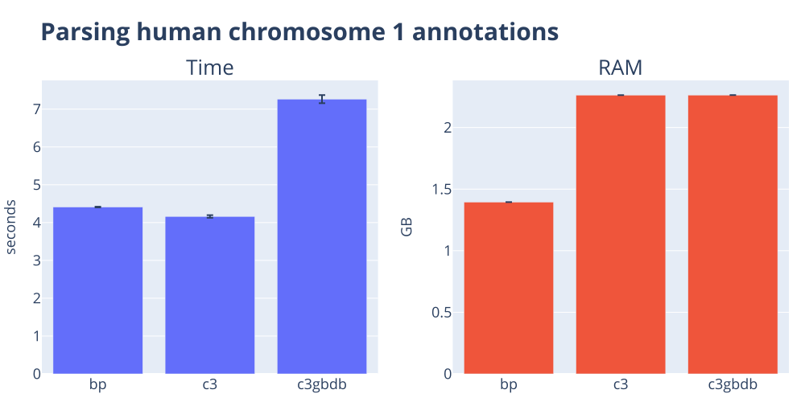

# Parser shootout

Bioinformatics data processing remains dominated by plain text formats. In this post, I contrast the performance of popular tools for reading two sequence file formats and two genome annotation formats. Despite how simple the task might seem, you'll see there's a lot of variation in performance!

<!-- more -->

## The goal

The objective in this post is to examine the performance of popular packages in reading standard file formats. I'm focusing on the ability to simply rip data off disk into Python primitives. In the case of some of the packages I'll be comparing, the returned objects are not all that primitive, which can degrade computational performance. This is not necessarily a bad thing since these richer objects can provide really valuable interfaces for utilizing the underlying data. I won't be discussing the capabilities of these objects in this post, but just focusing on raw performance.

??? note "Methods"
    The benchmark code lives in [the c3-benchmarking repository](https://github.com/cogent3/c3-benchmarking).

    I time each `(task, tool)` pair with [hyperfine](https://github.com/sharkdp/hyperfine) as a standalone process. The orchestrator invokes `hyperfine --command-name <tool> '<shell-cmd>'` once per tool, runs each command three times by default, and aggregates the mean and standard deviation of wall-clock time and peak resident memory into a per-task TSV.

    A caveat on macOS: hyperfine's peak-RSS measurement uses `getrusage(RUSAGE_CHILDREN)`, which accumulates across reaped children. The second and later commands in a single hyperfine session therefore inherit the prior high-watermark, so reported RAM for those rows is an upper bound rather than an accurate per-tool peak. As all tools will be affected by this, we ignore it.

    **Dataset summary**

    --8<-- "docs/posts/benchmark_parsers/datasets_summary.txt"

Get the repo with code for running this HERE, that repo has a script for downloading the data

What will be measured

What is being compared

--8<-- "docs/posts/benchmark_parsers/tools_summary.txt"

## Comparing sequence format parsers

### fasta formatted sequences

--8<-- "docs/posts/benchmark_parsers/parse_fa_snippets.txt"

### GenBank formatted sequences

--8<-- "docs/posts/benchmark_parsers/parse_gbk_snippets.txt"

## Comparing annotation format parsers

### GFF3 formatted annotations

--8<-- "docs/posts/benchmark_parsers/parse_ann_gff_snippets.txt"

### GenBank formatted annotations

--8<-- "docs/posts/benchmark_parsers/parse_ann_gb_snippets.txt"

??? note "Summary table for human chromosome 1"
    --8<-- "docs/posts/benchmark_parsers/parse_ann_gbk_human.txt"

