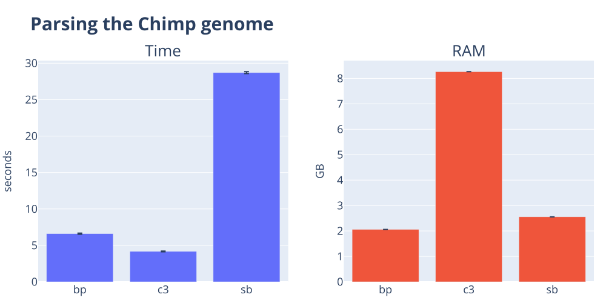
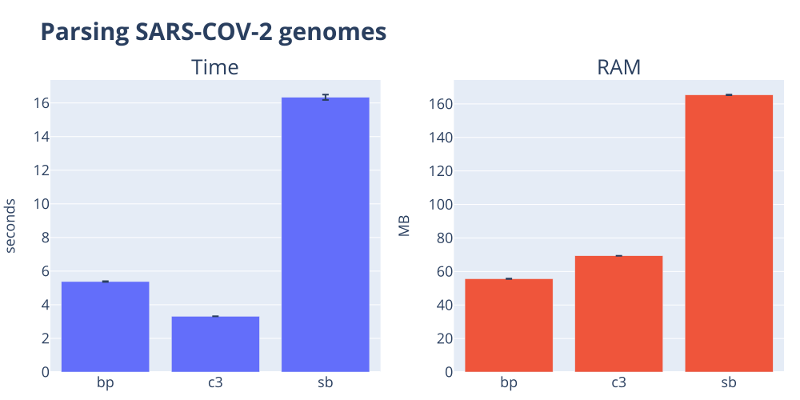
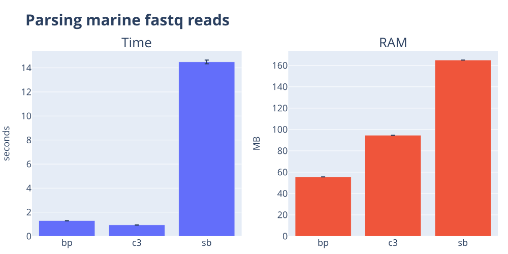
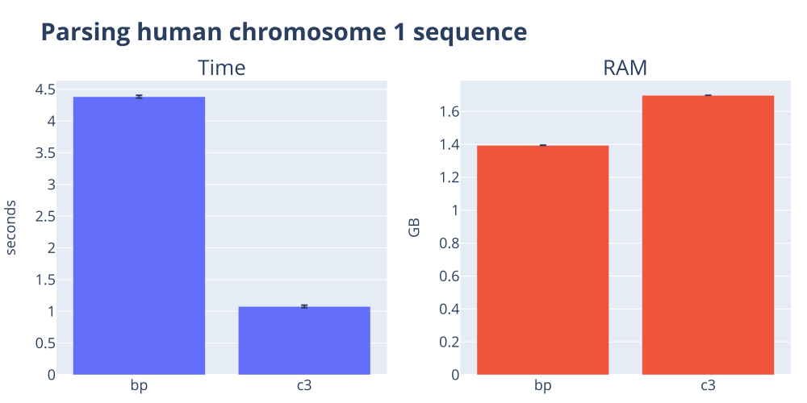
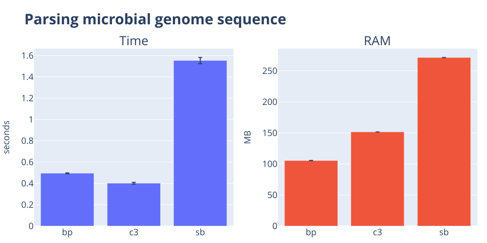
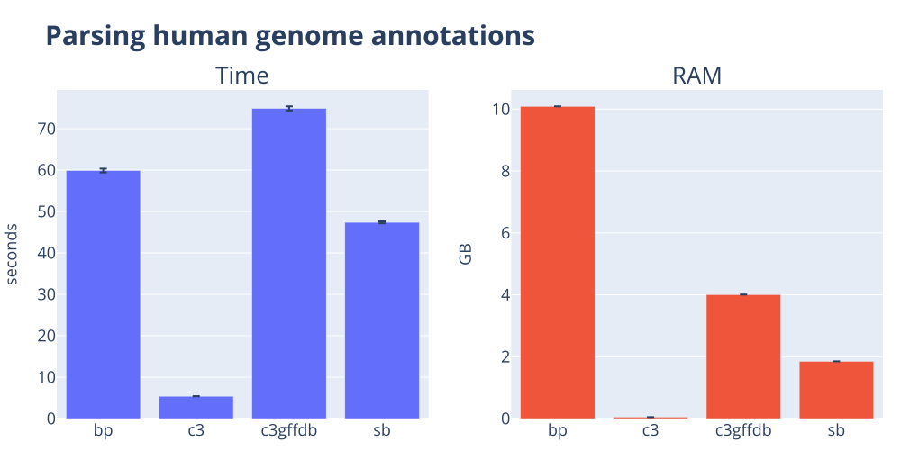
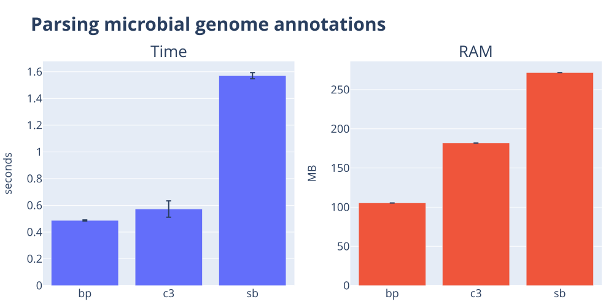

# The parser shootout 🔫

Bioinformatics data processing remains dominated by plain text formats. In this post, I contrast the performance of the popular [biopython](https://biopython.org), [cogent3](https://cogent3.org), and [scikit-bio](https://scikit-bio.org) packages for reading three sequence file formats and two genome annotation formats. Despite how simple these tasks might seem, you'll see there's a lot of variation in performance! The takeaway message is that cogent3 is nearly always faster for parsing these basic file formats, while biopython typically uses less RAM.
<!-- more -->

## The goal

The goal of this post is to compare how well popular packages read standard file formats. I focus on how quickly and simply they can pull data off disk into Python primitives[^1]. For some of the packages I compare, the returned objects are more complex than simple primitives, which can reduce computational performance. This is not necessarily a drawback, because these richer objects can offer powerful interfaces for working with the data. However, in this post, I won’t discuss those capabilities but focus solely on raw performance.

Before proceeding further, I note that these comparisons were conducted entirely using uncompressed files. Of the three packages compared here, only cogent3 appears to seamlessly support compressed input files. Specifically, if a file path ends with a recognised compression suffix (e.g., `.gz`), cogent3 automatically selects the appropriate decompressor and processes the file on the fly[^2], without requiring any additional effort from the user.

??? info "What handling compression looks like"

    You have to figure out how to handle the compression, probably based on the filename suffix. And then import the correct module. cogent3 does this for you automatically for `gzip`, `bzip2`, `zip`, `xz`, and `lzma`.

    === "This"

        ```python
        import cogent3 as c3

        seqs = list(c3.parse.fasta.iter_fasta_records("path/to/file.fa.gz"))
        ```

    === "Instead of This"

        ```python
        import gzip
        import cogent3 as c3

        with gzip.open("path/to/file.fa.gz", "rt") as f:
            seq = list(c3.parse.fasta.iter_fasta_records(f))
        ```


As downloaded genomic data files are often distributed in compressed form, the lack of equivalent support in the other two packages is a practical inconvenience. The comments below regarding code complexity do not take this issue into account.

[^1]: By Python primitive, I mean basic Python types such as strings, lists, dicts, or tuples.
[^2]: This feature is provided by [scinexus](https://scinexus.readthedocs.io).

!!! tip "In the figures below, smaller is better for both compute-time and RAM."

??? info "Methods and Datasets"
    The benchmark code lives in [the c3-benchmarking repository](https://github.com/cogent3/c3-benchmarking).

    I time each `(task, tool)` pair as a standalone process using [hyperfine](https://github.com/sharkdp/hyperfine). The orchestrator invokes `hyperfine --command-name <tool> '<shell-cmd>'` once per tool, runs each command three times by default, and aggregates the mean and standard deviation of wall-clock time and peak resident memory into a per-task TSV. This means we include Python startup, imports, and all that fun stuff as part of the measurements.
    
    **Dataset summary**
    
    These datasets can be obtained via the repo linked to above.
    
    --8<-- "docs/posts/benchmark_parsers/datasets_summary.txt"

??? info "Tools summary"
    The abbreviations shown in the table are used in all the result tables and figures below. We also include code snippets used for each tool. These are extracted verbatim from the benchmarking project and hence contained within individual functions.

    biopython is the oldest of these packages, dating back to 2002. cogent3 and scikit-bio both originated from PyCogent ([published in 2007](https://www.ncbi.nlm.nih.gov/pubmed/17708774)). cogent3 is the closest to the original PyCogent feature set while scikit-bio appears to be primarily focussed on microbes. I note here I was a founder of the PyCogent project and am the founder of cogent3.

    --8<-- "docs/posts/benchmark_parsers/tools_summary.txt"

## Comparing sequence format parsers

### FASTA formatted sequences

--8<-- "docs/posts/benchmark_parsers/parse_fa_snippets.txt"

??? note "Results table for parsing the Chimpanzee genome"
    --8<-- "docs/posts/benchmark_parsers/parse_fasta_ptro.txt"



??? note "Results table for parsing a SARS-COV-2 genomes file"
    --8<-- "docs/posts/benchmark_parsers/parse_fasta_sars_msa.txt"



### FASTQ formatted sequences

--8<-- "docs/posts/benchmark_parsers/parse_fq_snippets.txt"

??? note "Results table for parsing the marine fastq reads"
    --8<-- "docs/posts/benchmark_parsers/parse_fastq_marine.txt"



### GenBank formatted sequences

--8<-- "docs/posts/benchmark_parsers/parse_gbk_snippets.txt"

??? note "Results table for human chromosome 1"
    --8<-- "docs/posts/benchmark_parsers/parse_gbk_human.txt"

!!! warning "sb failed to parse this file"



??? note "Results table for micro"
    --8<-- "docs/posts/benchmark_parsers/parse_gbk_micro.txt"



### Summary of sequence format parsing performance

Regarding speed, cogent3 consistently ranked as the fastest parser for sequence formats, with biopython coming second. In terms of memory usage, biopython always used the least, typically followed by scikit-bio, with cogent3 the largest. This is due to a default value employed by `scinexus` data streaming[^3]. It is also worth noting that scikit-bio was unable to parse the GenBank file for Human chromosome 1, which is why it is not included in that particular plot.

[^3]: At least part of the reason cogent3 is using more RAM is due to a default 5MB chunk size employed by scinexus streaming parsers. Reducing that chunk size reduces peak RAM at the cost of a small increase in compute time.


## Comparing annotation format parsers

### GFF3 formatted annotations

--8<-- "docs/posts/benchmark_parsers/parse_ann_gff_snippets.txt"

??? note "Results table for human chromosome 1"
    --8<-- "docs/posts/benchmark_parsers/parse_ann_gff_human.txt"



### GenBank formatted annotations

--8<-- "docs/posts/benchmark_parsers/parse_ann_gb_snippets.txt"

??? note "Results table for human chromosome 1"
    --8<-- "docs/posts/benchmark_parsers/parse_ann_gbk_human.txt"

!!! warning "sb failed to parse this file"


??? note "Results table for micro"
    --8<-- "docs/posts/benchmark_parsers/parse_ann_gb_micro.txt"



### Summary of annotation format parsing performance

It is difficult to make fair comparisons here, since only cogent3 returns Python primitives. We therefore included cogent3's rich in-memory annotation databases[^4] in the comparisons.

cogent3 raw parser was the fastest, except for the microbial genome GenBank file, where biopython was marginally faster. The GFF3[^5] parsing story was interesting, with c3gffdb the slowest, followed by biopython. biopython's used substantially more RAM than the basic parsers. biopython's relative performance was better on extracting annotation data from GenBank files, with the lowest RAM and a marginally faster speed for one case. cogent3's c3gbdb was faster and required less RAM than scikit-bio on the microbial GenBank file.

[^4]: I included the `c3gbdb` and `c3gffdb` examples as they are the richest objects cogent3 delivers from parsing annotations. We will explore the objects returned by the sequence annotation parsing in a future post.

[^5]: This GFF3 file covered the entire human genome and thus included all human genes, transcripts and exons. 

## Conclusions

For these simple tasks, the code complexity of the different packages are comparable with one exception[^6]. Computational performance, however, was not.

In general, cogent3 showed the fastest run times but also used more RAM[^3] than biopython which was consistently second fastest. cogent3 was also, as far as I can tell, the only tool capable of returning the Python primitives. The value of that to you, the user, will vary based on your problem. But as the GenBank parsing cases show, being able to ignore annotations if you want sequences, or sequences if you want annotations, enables much faster delivery of the content that matters. Unfortunately, scikit-bio was consistently slower and typically required more RAM than the other packages.

Interpreting comparisons of annotation-data parsing requires an important qualification. Genome annotations can be viewed as the central product of genomics because they represent the current state of knowledge about the information encoded in a genome. Support for annotation data is therefore a fundamental capability of any genomics software package.

Annotation formats often encode complex relationships that span multiple rows within a file. Differences in how packages represent and reconstruct this information are likely the main source of the substantial performance differences observed here. For example, cogent3's basic parsers are designed to retrieve content as quickly as possible, without combining information across rows. The richer cogent3 objects[^4] are constructed from these parser results, and their performance reflects the added complexity of those algorithms.

Ultimately, the most meaningful measure of a package's annotation-handling capability is how effectively its tools support downstream queries. That will be the focus of a future post.

[^6]: cogent3 required two imports and an explicit creation of a converter for transforming raw fastq quality scores into `numpy` arrays. Strictly speaking, that's not required but it does deliver read `quality` as a comparable type to the other tools.
